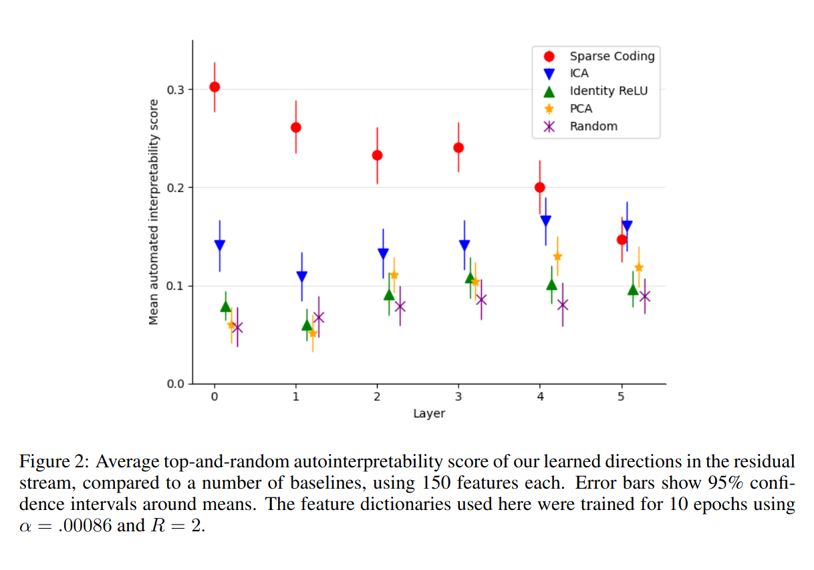
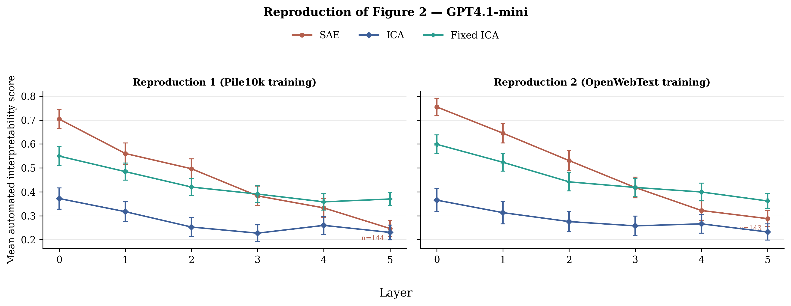
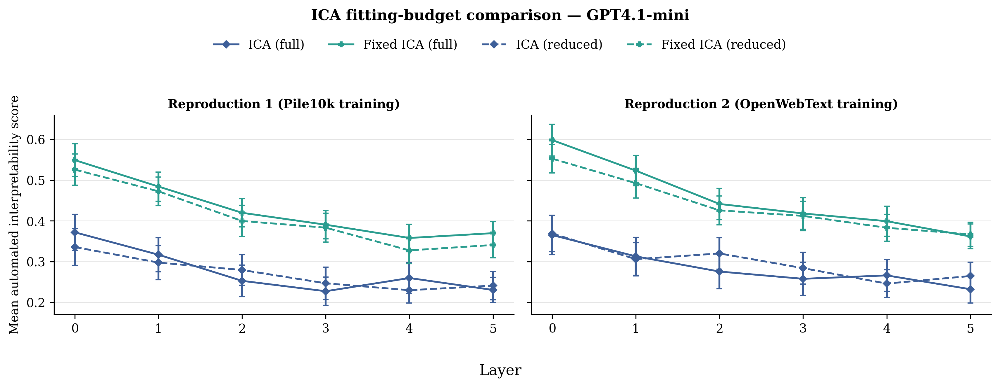
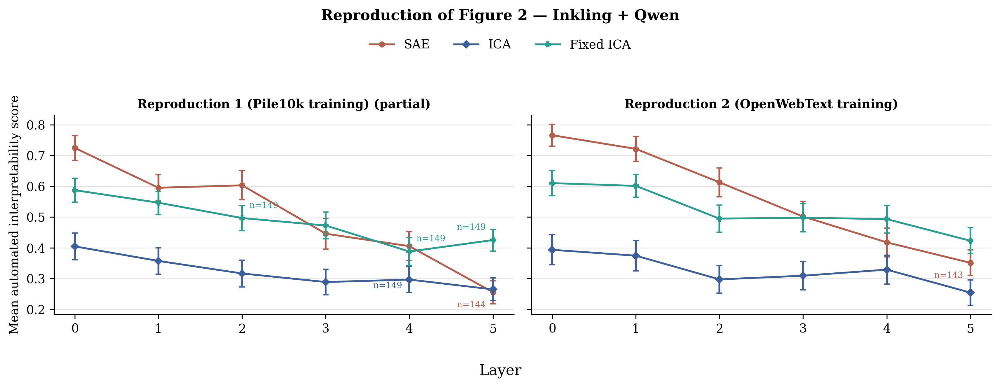

# ICA versus SAE: revisiting Figure 2 in 2026

This repository revisits the ICA-vs-SAE comparison in Figure 2 of
[*Sparse Autoencoders Find Highly Interpretable Features in Language
Models*](https://arxiv.org/abs/2309.08600). We preserve the original experiment
structure while replacing unavailable dependencies.

## Changes from the original experiment

The Pile training shard used by the original paper is no longer available, and
the original GPT-3.5/GPT-4 interpreter snapshots are retired. We therefore
replace those two components while retaining the paper's **OpenWebText**
evaluation protocol.

| Condition | Train | Eval | Interpreter model |
| --- | --- | --- | --- |
| Original | Pile (shard unavailable) | 50,000 fragments from the **OpenWebText** prefix | GPT-3.5/GPT-4 snapshots (retired) |
| Reproduction 1 | **Pile10k** | 50,000 **valid** fragments from the **OpenWebText** prefix | **GPT4.1-mini** |
| Reproduction 2 | **OpenWebText** documents 100,000–119,530 | 50,000 **valid** fragments from the **OpenWebText** prefix | **GPT4.1-mini** |

The **OpenWebText** training condition starts at document 100,000 rather than the
document-0 prefix used for evaluation, preventing train–evaluation overlap.

We also restore the missing `bias_decay` buffer in `FunctionalTiedSAE.init`.
The experiment sets `bias_decay=0.0`, so this fixes the public code's
initialization error without changing the SAE objective or gradients.

## Experiment

We compare ICA and the historical tied SAE at residual-stream layers 0–5 of
**Pythia-70m** in the two training-corpus conditions above.

After fitting each method, we evaluate 150 features. For each feature, we rank
50,000 evaluation examples, each a 64-token fragment, and select 20 top and 20
random examples. The interpreter generates an explanation from five top
examples, then predicts token activations from that explanation in independent
calls on held-out top and random examples; the score is the correlation between
predicted and actual activations.

| Method | Fitting budget | Top-example selection |
| --- | --- | --- |
| SAE | 20,981,760 input activations (**Pile10k**: 1.36 passes; **OpenWebText**: 1 pass) | Rank by maximum activation (SAE activations are nonnegative) |
| ICA | Complete first chunk (2,098,176 input activations); at most 200 iterations | Rank the positive tail; ignore the negative tail |
| Fixed ICA | Reuses ICA | **Orient the stronger fitting-data tail positive**, then rank the positive tail; ignore the negative tail |

These counts follow the released code. Its ten SAE checkpoints correspond to
ten 2 GiB chunks rather than ten conventional full-dataset epochs; its 2 GiB
ICA chunk contains 2,098,176 float16 activations, although the paper estimates
approximately four million.

All methods use the same 50,000 **OpenWebText** evaluation fragments, 150 source
features, prompts, and historical top-and-random scoring logic.

## Results

The original Figure 2 reported a large interpretability advantage for SAE
over ICA, especially in early layers. Our reproduction preserves that
comparison and isolates the effect of making the public code's ICA evaluation
less dependent on arbitrary component signs. The public-code procedure ranks
only the positive tail and can therefore ignore a component's stronger,
interpretable negative tail. **Fixed ICA** orients the stronger statistical
tail positively before applying the same top-example selection and scoring
procedure.

<table>
  <tr>
    <th>Original Figure 2</th>
    <th>Our reproduction</th>
  </tr>
  <tr>
    <td width="35%"></td>
    <td width="65%"></td>
  </tr>
</table>

We reproduce the early-layer SAE advantage. Stronger-tail orientation
substantially raises ICA's score, however, and Fixed ICA becomes competitive
around layer 3 and exceeds SAE in the later layers for both training corpora.
Our claim is limited to showing that the one-sided public evaluation can
substantially under-score ICA; we do not claim that the stronger tail is always
more interpretable or that this is the uniquely correct orientation rule.

Absolute scores should not be compared directly with the original figure
because its retired GPT-3.5/GPT-4 interpreters are replaced by
**GPT4.1-mini**. The comparisons among methods within each panel use the same
interpreter, examples, prompts, and scoring procedure.

## ICA need not be slow

For fidelity, the main reproduction retains the public code's CPU FastICA, but
GPU alternatives such as [`FastICA_torch`](https://github.com/liusida/FastICA_torch/)
are now available.

The released-code ICA condition fits approximately 2.1 million token
activations for at most 200 iterations. As a compute-constrained comparison, we
fit ICA on 524,288 activations for 20 iterations. After applying the same
stronger-tail orientation, its aggregate interpretability score is within about
0.02 of the released-code-budget fit on both training corpora.

<p align="center">
  
</p>

On our GX10, fitting all twelve reduced ICA models with the CPU implementation
took approximately 17 minutes, compared with 28 minutes for training the twelve
SAEs on GPU; data loading and serialization took another 16 minutes shared by
the experiment. A GPU FastICA implementation offers an additional acceleration
path, although we do not benchmark it here. Thus, with an appropriate fitting
budget and implementation, ICA fitting can require substantially less time
than SAE training without materially changing this comparison.


## Reproduction

Use Python 3.10. Put the API key in an untracked `.env` file as
`OPENAI_API_KEY=...`, then run:

```bash
uv venv --python 3.10
source .venv/bin/activate
uv pip install -r requirements.txt

# Extract training activations for both corpora and all six layers.
python reproduce_ica_vs_sae.py prepare

# Train SAE.
python reproduce_ica_vs_sae.py train

# Fit released-code-budget ICA (the expensive CPU stage).
python reproduce_ica_vs_sae.py train-ica-full

# Fix ICA signs using only the activations used to fit each ICA model.
python reproduce_ica_vs_sae.py orient-ica

# Encode the shared evaluation fragments with each fitted model.
python reproduce_ica_vs_sae.py eval-data

# Verify interpreter compatibility (makes small API requests).
python reproduce_ica_vs_sae.py check-api --interpreter-model gpt-4.1-mini-2025-04-14

# Explain and score features (the paid API stage).
python reproduce_ica_vs_sae.py interpret --interpreter-model gpt-4.1-mini-2025-04-14

# Aggregate scores and confidence intervals.
python reproduce_ica_vs_sae.py summarize --interpreter-model gpt-4.1-mini-2025-04-14

# Plot every completed interpreter grid (PNG, PDF, and caption).
python reproduce_ica_vs_sae.py plot

# Plot the separate full-versus-reduced ICA budget comparison.
python reproduce_ica_vs_sae.py plot --plot-view reduced
```

Stages are restartable. Only `check-api` and `interpret` call the OpenAI API.
Generated artifacts and per-run metadata are written under
`reproductions/ica_vs_sae/`.

An optional independent Inkling-explainer/Qwen-simulator evaluation uses an
isolated Python 3.11 environment; see [`tinker_evaluator/`](tinker_evaluator/).

## Python change audit

The reproduction changes seven Python files relative to the public repository.
Four are small compatibility fixes to existing files; the experiment workflows
and current evaluators are isolated in three new files.

**Key experimental change:** the Fixed ICA path in `modern_interpret.py`
resolves ICA's arbitrary sign before selecting top examples. Without a sign
rule, the public evaluation can rank a component's weaker positive tail while
ignoring its stronger, interpretable negative tail.

<table>
  <thead>
    <tr>
      <th>File</th>
      <th>Status</th>
    </tr>
  </thead>
  <tbody>
    <tr>
      <td><strong><code>modern_interpret.py</code></strong></td>
      <td><strong>Added — key experimental change</strong></td>
    </tr>
    <tr>
      <td colspan="2">Reimplements the retired OpenAI interpretation interface using current chat completions, structured activation labels, token log probabilities, retries, pacing, and resumable per-feature outputs. It preserves the historical top/random split and correlation score, extracts the shared evaluation activations, and, for Fixed ICA, <strong>applies fitting-data orientations before top-example selection</strong>.</td>
    </tr>
    <tr>
      <td><code>activation_dataset.py</code></td>
      <td>Modified</td>
    </tr>
    <tr>
      <td colspan="2">Replaces the unavailable hard-coded Pile shard download with a bounded, deterministic Hugging Face dataset stream. Adds explicit dataset-range validation and an optional document limit, and prevents this text-only pipeline from importing torchvision's optional video support.</td>
    </tr>
    <tr>
      <td><code>autoencoders/ica.py</code></td>
      <td>Modified</td>
    </tr>
    <tr>
      <td colspan="2">Defers type annotations and makes <code>torchtyping</code> a type-checking-only import, avoiding a runtime compatibility dependency. ICA fitting and dictionary calculations are unchanged.</td>
    </tr>
    <tr>
      <td><code>autoencoders/learned_dict.py</code></td>
      <td>Modified</td>
    </tr>
    <tr>
      <td colspan="2">Applies the same annotation and type-checking-only compatibility change. Learned-dictionary behavior is unchanged.</td>
    </tr>
    <tr>
      <td><code>autoencoders/sae_ensemble.py</code></td>
      <td>Modified</td>
    </tr>
    <tr>
      <td colspan="2">Adds the missing <code>bias_decay</code> buffer during tied-SAE initialization. This is the one-line fix required for the public training path to run; its value is zero in this experiment.</td>
    </tr>
    <tr>
      <td><code>reproduce_ica_vs_sae.py</code></td>
      <td>Added</td>
    </tr>
    <tr>
      <td colspan="2">Provides the restartable command-line workflow for preparation, SAE training, reduced- and released-code-budget ICA fitting, evaluation encoding, API checks, interpretation, statistical summaries, and figures. It records run metadata, fixes seeds, reports progress, and keeps paid API work confined to the interpretation stages.</td>
    </tr>
    <tr>
      <td><code>tinker_evaluator/interpret.py</code></td>
      <td>Added</td>
    </tr>
    <tr>
      <td colspan="2">Runs the optional Python 3.11 Tinker evaluator, using Inkling for explanations and Qwen3.8-27B for independent activation prediction. It reads the same evaluation artifacts and fitting-data ICA orientations and writes the standard resumable result schema.</td>
    </tr>
  </tbody>
</table>

The historical `interpret.py` and the model architectures are otherwise left
untouched. Reviewers can use this table as a map before inspecting the commit's
full diff.

## Details

- **Pile10k**: `NeelNanda/pile-10k`
- **OpenWebText**: `Skylion007/openwebtext`
- **GPT4.1-mini**: `gpt-4.1-mini-2025-04-14`
- **Pythia-70m**: `EleutherAI/pythia-70m-deduped`

## Additional experiment: Inkling → Qwen

As an independent evaluator check, we repeat the full grid using
**Inkling** to generate feature explanations and **Qwen3.8-27B** to predict
token activations. This pipeline reproduces the main qualitative result:
SAE leads in the early layers, orienting ICA’s stronger tail substantially
improves its score, and Fixed ICA becomes competitive with or exceeds SAE in
later layers. Absolute scores differ between evaluator pipelines and should
not be compared directly.

Qwen returned malformed simulator output for 8 of 9,000 feature–method
evaluations after six attempts (0.089%). We exclude these records rather than
truncate, pad, or manually repair them. Separately, 13 layer-5 SAE features
lacked the required 20 nonzero evaluation examples and are reported using the
resulting sample counts.

<p align="center">
  
</p>

## Further discussion

For further discussion and results, please refer to our
[ICA Lens paper](https://arxiv.org/abs/2606.11722).
